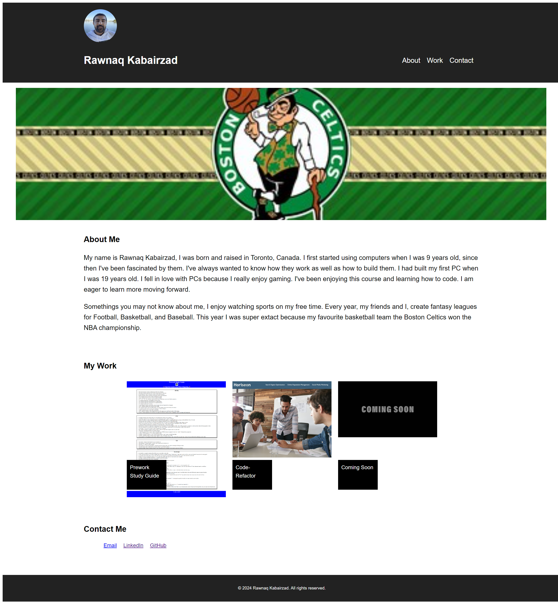

# Portfolio

## Description
An easy to use webpage that displays and links all the work I've accomplished so far in the Coding Bootcamp. Included is a section for ways to get in contact with me. 

## Installation
N/A

## Usage
If you click on any of the headers; About, Work, or Contact the page will scroll down to there respective sections. Each image in the My Work section links to the different projects or challenges I have worked on. You may also use the Contact Me section to get a hold of me in multiple different ways like email or linkedin.

## Preview

[Click here to preview My Portfolio](https://rawnaqk.github.io/Portfolio/)

## Credits
N/A

## License
Please refer to the LICENSE in the repo.